# Intro:
The following work was done for the Kaggle competition: [2019 Data Science Bowl](https://www.kaggle.com/c/data-science-bowl-2019). Contestants were provided with four datasets, from **PBS KIDS Measure Up! app**:
- train.csv - the training set
- train_labels.csv - the ground truth labels for the training set
- specs.csv -  the specification of the various event types
- test.csv - the test set 

and were asked to predict the level of accuracy of a user completing an in-app assessment. 

Submissions were evaluated on based on the quadratic weighted kappa, which measures the agreement between two outcomes. 

# Index:
1. Data Exploration
2. Feature Engineering
3. Feature Selection and Preprocessing
4. Model Training/Evaluation/Selection

In this post I discuss steps 1-2.

[**Github Code**](https://github.com/vasilis-stylianou/Data-Science/tree/master/Projects/Kaggle_IEEE_Fraud) 

# Libraries


```python
import pandas as pd
import numpy as np
import matplotlib.pyplot as plt
import seaborn as sns
import json 
import os
from pprint import pprint
sns.set_style("whitegrid")
my_pal = sns.color_palette(n_colors=10)

pd.set_option('display.max_rows', 500)
pd.set_option('display.max_columns', 500)
pd.set_option('display.width', 1000)
```

# A. Load Data (a sample)


```python
def load_and_process_data(path, nrows=1000000, timestamp=False):
    
    # load data
    if timestamp:
        df = pd.read_csv(path, nrows=nrows, parse_dates=['timestamp'])
    else:
        df = pd.read_csv(path, nrows=nrows)
    
    # convert utf-16-like ids to integers
    try:
        df['installation_id'] = df['installation_id'].apply(lambda x: int(x,16))
    except:
        pass

    # convert milliseconds to mins
    try:
        df['game_time'] = df['game_time'].apply(lambda x: round(x/(1000*60),2))
    except:
        pass
    
    # convert string dict representation to dict
    try:
        df['event_data'] = df['event_data'].apply(json.loads)
    except:
        pass
    
    df = df.set_index(['installation_id','game_session'])
    
    return df
```

### A.1 Train


```python
train = load_and_process_data('./data/train.csv', nrows=1000000, timestamp=True)
train.head()
```


<div>
<style scoped>
    .dataframe tbody tr th:only-of-type {
        vertical-align: middle;
    }

    .dataframe tbody tr th {
        vertical-align: top;
    }

    .dataframe thead th {
        text-align: right;
    }
</style>
<table border="1" class="dataframe">
  <thead>
    <tr style="text-align: right;">
      <th></th>
      <th></th>
      <th>event_id</th>
      <th>timestamp</th>
      <th>event_data</th>
      <th>event_count</th>
      <th>event_code</th>
      <th>game_time</th>
      <th>title</th>
      <th>type</th>
      <th>world</th>
    </tr>
    <tr>
      <th>installation_id</th>
      <th>game_session</th>
      <th></th>
      <th></th>
      <th></th>
      <th></th>
      <th></th>
      <th></th>
      <th></th>
      <th></th>
      <th></th>
    </tr>
  </thead>
  <tbody>
    <tr>
      <td rowspan="5" valign="top">125199</td>
      <td>45bb1e1b6b50c07b</td>
      <td>27253bdc</td>
      <td>2019-09-06 17:53:46.937000+00:00</td>
      <td>{'event_code': 2000, 'event_count': 1}</td>
      <td>1</td>
      <td>2000</td>
      <td>0.00</td>
      <td>Welcome to Lost Lagoon!</td>
      <td>Clip</td>
      <td>NONE</td>
    </tr>
    <tr>
      <td>17eeb7f223665f53</td>
      <td>27253bdc</td>
      <td>2019-09-06 17:54:17.519000+00:00</td>
      <td>{'event_code': 2000, 'event_count': 1}</td>
      <td>1</td>
      <td>2000</td>
      <td>0.00</td>
      <td>Magma Peak - Level 1</td>
      <td>Clip</td>
      <td>MAGMAPEAK</td>
    </tr>
    <tr>
      <td>0848ef14a8dc6892</td>
      <td>77261ab5</td>
      <td>2019-09-06 17:54:56.302000+00:00</td>
      <td>{'version': '1.0', 'event_count': 1, 'game_tim...</td>
      <td>1</td>
      <td>2000</td>
      <td>0.00</td>
      <td>Sandcastle Builder (Activity)</td>
      <td>Activity</td>
      <td>MAGMAPEAK</td>
    </tr>
    <tr>
      <td>0848ef14a8dc6892</td>
      <td>b2dba42b</td>
      <td>2019-09-06 17:54:56.387000+00:00</td>
      <td>{'description': 'Let's build a sandcastle! Fir...</td>
      <td>2</td>
      <td>3010</td>
      <td>0.00</td>
      <td>Sandcastle Builder (Activity)</td>
      <td>Activity</td>
      <td>MAGMAPEAK</td>
    </tr>
    <tr>
      <td>0848ef14a8dc6892</td>
      <td>1bb5fbdb</td>
      <td>2019-09-06 17:55:03.253000+00:00</td>
      <td>{'description': 'Let's build a sandcastle! Fir...</td>
      <td>3</td>
      <td>3110</td>
      <td>0.12</td>
      <td>Sandcastle Builder (Activity)</td>
      <td>Activity</td>
      <td>MAGMAPEAK</td>
    </tr>
  </tbody>
</table>
</div>


### Remove Noisy Data

Noise: game_time =0  and incorrect 

### A.2 Labels


```python
train_labels = load_and_process_data('./data/train_labels.csv', nrows=1000000)
train_labels.head()
```


<div>
<style scoped>
    .dataframe tbody tr th:only-of-type {
        vertical-align: middle;
    }

    .dataframe tbody tr th {
        vertical-align: top;
    }

    .dataframe thead th {
        text-align: right;
    }
</style>
<table border="1" class="dataframe">
  <thead>
    <tr style="text-align: right;">
      <th></th>
      <th></th>
      <th>title</th>
      <th>num_correct</th>
      <th>num_incorrect</th>
      <th>accuracy</th>
      <th>accuracy_group</th>
    </tr>
    <tr>
      <th>installation_id</th>
      <th>game_session</th>
      <th></th>
      <th></th>
      <th></th>
      <th></th>
      <th></th>
    </tr>
  </thead>
  <tbody>
    <tr>
      <td rowspan="5" valign="top">435871</td>
      <td>6bdf9623adc94d89</td>
      <td>Mushroom Sorter (Assessment)</td>
      <td>1</td>
      <td>0</td>
      <td>1.0</td>
      <td>3</td>
    </tr>
    <tr>
      <td>77b8ee947eb84b4e</td>
      <td>Bird Measurer (Assessment)</td>
      <td>0</td>
      <td>11</td>
      <td>0.0</td>
      <td>0</td>
    </tr>
    <tr>
      <td>901acc108f55a5a1</td>
      <td>Mushroom Sorter (Assessment)</td>
      <td>1</td>
      <td>0</td>
      <td>1.0</td>
      <td>3</td>
    </tr>
    <tr>
      <td>9501794defd84e4d</td>
      <td>Mushroom Sorter (Assessment)</td>
      <td>1</td>
      <td>1</td>
      <td>0.5</td>
      <td>2</td>
    </tr>
    <tr>
      <td>a9ef3ecb3d1acc6a</td>
      <td>Bird Measurer (Assessment)</td>
      <td>1</td>
      <td>0</td>
      <td>1.0</td>
      <td>3</td>
    </tr>
  </tbody>
</table>
</div>


### A3. Merge all Assessment train data


```python
assessments = pd.merge(train[train.type == 'Assessment'], train_labels, 
                       left_index=True, right_index=True, how='inner')

# clean df
assessments = assessments.drop(['title_y','type'],axis=1)\
                         .rename({'title_x':'title'},axis=1)
```


```python
assessments.head()
```


<div>
<style scoped>
    .dataframe tbody tr th:only-of-type {
        vertical-align: middle;
    }

    .dataframe tbody tr th {
        vertical-align: top;
    }

    .dataframe thead th {
        text-align: right;
    }
</style>
<table border="1" class="dataframe">
  <thead>
    <tr style="text-align: right;">
      <th></th>
      <th></th>
      <th>event_id</th>
      <th>timestamp</th>
      <th>event_data</th>
      <th>event_count</th>
      <th>event_code</th>
      <th>game_time</th>
      <th>title</th>
      <th>world</th>
      <th>num_correct</th>
      <th>num_incorrect</th>
      <th>accuracy</th>
      <th>accuracy_group</th>
    </tr>
    <tr>
      <th>installation_id</th>
      <th>game_session</th>
      <th></th>
      <th></th>
      <th></th>
      <th></th>
      <th></th>
      <th></th>
      <th></th>
      <th></th>
      <th></th>
      <th></th>
      <th></th>
      <th></th>
    </tr>
  </thead>
  <tbody>
    <tr>
      <td rowspan="5" valign="top">435871</td>
      <td>6bdf9623adc94d89</td>
      <td>3bfd1a65</td>
      <td>2019-08-06 05:37:50.020000+00:00</td>
      <td>{'version': '1.0', 'event_count': 1, 'game_tim...</td>
      <td>1</td>
      <td>2000</td>
      <td>0.00</td>
      <td>Mushroom Sorter (Assessment)</td>
      <td>TREETOPCITY</td>
      <td>1</td>
      <td>0</td>
      <td>1.0</td>
      <td>3</td>
    </tr>
    <tr>
      <td>6bdf9623adc94d89</td>
      <td>db02c830</td>
      <td>2019-08-06 05:37:50.078000+00:00</td>
      <td>{'event_count': 2, 'game_time': 77, 'event_cod...</td>
      <td>2</td>
      <td>2025</td>
      <td>0.00</td>
      <td>Mushroom Sorter (Assessment)</td>
      <td>TREETOPCITY</td>
      <td>1</td>
      <td>0</td>
      <td>1.0</td>
      <td>3</td>
    </tr>
    <tr>
      <td>6bdf9623adc94d89</td>
      <td>a1e4395d</td>
      <td>2019-08-06 05:37:50.082000+00:00</td>
      <td>{'description': 'Pull three mushrooms out of t...</td>
      <td>3</td>
      <td>3010</td>
      <td>0.00</td>
      <td>Mushroom Sorter (Assessment)</td>
      <td>TREETOPCITY</td>
      <td>1</td>
      <td>0</td>
      <td>1.0</td>
      <td>3</td>
    </tr>
    <tr>
      <td>6bdf9623adc94d89</td>
      <td>7da34a02</td>
      <td>2019-08-06 05:37:52.799000+00:00</td>
      <td>{'coordinates': {'x': 199, 'y': 484, 'stage_wi...</td>
      <td>4</td>
      <td>4070</td>
      <td>0.05</td>
      <td>Mushroom Sorter (Assessment)</td>
      <td>TREETOPCITY</td>
      <td>1</td>
      <td>0</td>
      <td>1.0</td>
      <td>3</td>
    </tr>
    <tr>
      <td>6bdf9623adc94d89</td>
      <td>28ed704e</td>
      <td>2019-08-06 05:37:53.631000+00:00</td>
      <td>{'height': 1, 'coordinates': {'x': 171, 'y': 5...</td>
      <td>5</td>
      <td>4025</td>
      <td>0.06</td>
      <td>Mushroom Sorter (Assessment)</td>
      <td>TREETOPCITY</td>
      <td>1</td>
      <td>0</td>
      <td>1.0</td>
      <td>3</td>
    </tr>
  </tbody>
</table>
</div>


# B. Data Exploration/Visualization

## B1. Bad data

Observe that the accuracy (or equivalently the num_correct) is the same for all events generated in the same assessmnet session:


```python
temp_df = assessments.groupby(['installation_id','game_session'])[['event_count','accuracy']]\
                     .agg({'event_count':'count', 'accuracy':'sum'})
temp_df.head()

```


<div>
<style scoped>
    .dataframe tbody tr th:only-of-type {
        vertical-align: middle;
    }

    .dataframe tbody tr th {
        vertical-align: top;
    }

    .dataframe thead th {
        text-align: right;
    }
</style>
<table border="1" class="dataframe">
  <thead>
    <tr style="text-align: right;">
      <th></th>
      <th></th>
      <th>event_count</th>
      <th>accuracy</th>
    </tr>
    <tr>
      <th>installation_id</th>
      <th>game_session</th>
      <th></th>
      <th></th>
    </tr>
  </thead>
  <tbody>
    <tr>
      <td rowspan="5" valign="top">435871</td>
      <td>6bdf9623adc94d89</td>
      <td>35</td>
      <td>35.0</td>
    </tr>
    <tr>
      <td>77b8ee947eb84b4e</td>
      <td>87</td>
      <td>0.0</td>
    </tr>
    <tr>
      <td>901acc108f55a5a1</td>
      <td>48</td>
      <td>48.0</td>
    </tr>
    <tr>
      <td>9501794defd84e4d</td>
      <td>42</td>
      <td>21.0</td>
    </tr>
    <tr>
      <td>a9ef3ecb3d1acc6a</td>
      <td>32</td>
      <td>32.0</td>
    </tr>
  </tbody>
</table>
</div>


Observe that there are no assessment sessions with event_count=1:


```python
np.sum(temp_df.event_count[temp_df.event_count==1])
```


    0


On the other hand, the whole ```train``` dataset has a lot of sessions with event_count=1:


```python
print('Fraction of single-event sessions in train: {0}/{1} = {2}%'\
      .format(
              np.sum(train.event_count[train.event_count==1]),
              len(train),
              round(np.sum(train.event_count[train.event_count==1])/len(train)*100,2)
             )
     )
```

    Fraction of single-event sessions in train: 28338/1000000 = 2.83%


```python
del temp_df
```

Note: game sessions with a single event have an event_code = 2000 which represents the start of the session.

## <font color='green'> IGNORE: game sessions with a single event</font> 


```python
def filter_out_bad_sess(df):
    """Method to select only game sessions with more than one event."""
    
    temp_df = df.groupby(['installation_id','game_session'])[['event_count']].count()

    return df.loc[temp_df[temp_df.event_count>1].index,:]
```


```python
train = filter_out_bad_sess(train)
```

## B2. Visualize cols and accuracies

There are 10 columns:


```python
train.columns.tolist() + ['game_session']
```


    ['event_id',
     'timestamp',
     'event_data',
     'event_count',
     'event_code',
     'game_time',
     'title',
     'type',
     'world',
     'game_session']


Let's start our data exploration with the categorical data.

## <font color='blue'>Categorical Data<font>

### 1) Title


```python
title_val_counts = train['title'].value_counts().sort_values()
_ = title_val_counts.plot(kind='barh',figsize=(20,10))
_ = plt.gcf().suptitle("Title Frequencies", size = 18)
```


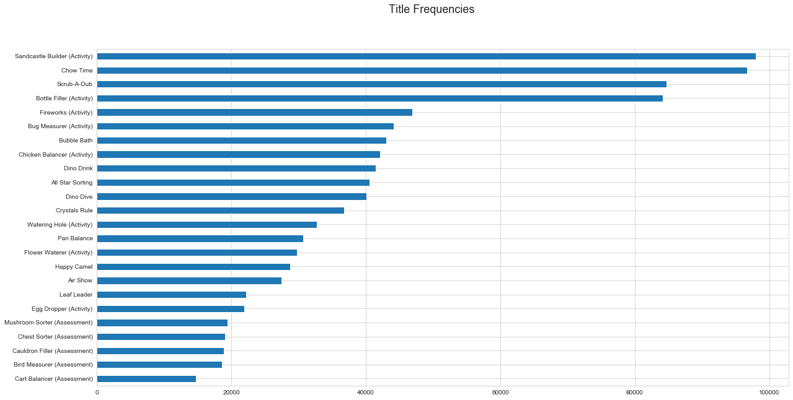


```python
pct_corrects = lambda g: round(g.sum()/g.count(),3)
assess_title = assessments.groupby(['title'])[['num_correct']]\
                          .agg(['count','sum', pct_corrects])
```


```python
# Clean df
assess_title.columns = ['num_assessments', 'num_correct', 'pct_correct']
assess_title['pct_incorrect'] =  1 - assess_title.pct_correct
assess_title.index = [title.split('(')[0].strip() for title in assess_title.index]
```


```python
assess_title.loc[:,['pct_correct','pct_incorrect']]\
            .plot.barh(stacked=True,figsize=(10, 6), title='Correct Assessment (by title)')
plt.gca().legend(frameon=True,loc=(1.05,0.9))
plt.gca().axvline(x=0.5, ymin=0, ymax=1, color='black')

del assess_title
```


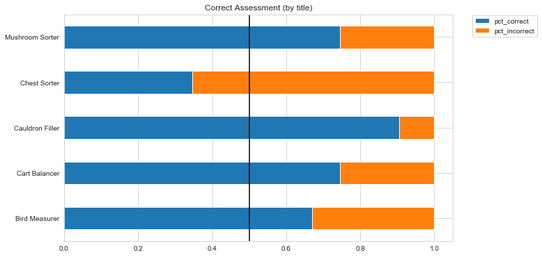


## <font color='green'> Good cols: ```'title'```</font> 

QUESTION: What pct of activities get completed and reach the assessment phase?

### 2) World


```python
world_val_counts = train['world'].value_counts().sort_values()
_ = world_val_counts.plot(kind='bar',figsize=(8,5), color=my_pal[0])
_ = plt.gcf().suptitle("World Frequencies", size = 18)
ax = plt.gca()
_ = ax.set_xticklabels(ax.get_xticklabels(),rotation=0)
```


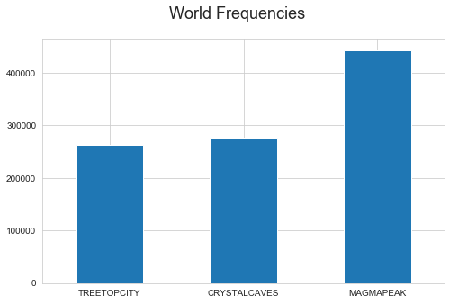


```python
assess_world = assessments.groupby(['world'])[['num_correct']]\
                          .agg(['count','sum', pct_corrects])

# Clean df
assess_world.columns = ['num_assessments', 'num_correct', 'pct_correct']
assess_world['pct_incorrect'] =  1 - assess_world.pct_correct
assess_world.index = [title.split('(')[0].strip() for title in assess_world.index]

assess_world.loc[:,['pct_correct','pct_incorrect']]\
            .plot.barh(stacked=True,figsize=(10, 6), title='Correct Assessment (by title)')
plt.gca().legend(frameon=True,loc=(1.05,0.9))
plt.gca().axvline(x=0.5, ymin=0, ymax=1, color='black')

del assess_world
```


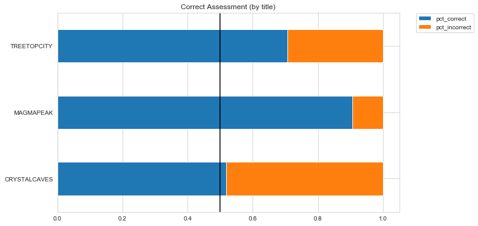


## <font color='green'> Good cols: ```'world'```  </font> 

### 3) Timestamps


```python
def plot_assess_vs_timestamps(df, use_col):
    df = df.groupby(use_col)[['num_correct']]\
           .agg(['count','sum', pct_corrects])

    # Clean df
    df.columns = ['num_assessments', 'num_correct', 'pct_correct']
    df['pct_incorrect'] =  1 - df.pct_correct
    
    # Plot accuracies
    df.loc[:,['pct_correct','pct_incorrect']]\
                .plot.barh(stacked=True,figsize=(10, 6), title=f'Correct Assessment (by {use_col})')
    plt.gca().legend(frameon=True,loc=(1.05,0.9))
    plt.gca().axvline(x=0.5, ymin=0, ymax=1, color='black')
    
    
    return "STD of pct_correct for " + use_col + ": {:.2f}".format(df['pct_correct'].std())
```


```python
assessments['hour'] = assessments['timestamp'].dt.hour
assessments['day'] = assessments['timestamp'].dt.day
assessments['weekday'] = assessments['timestamp'].dt.weekday
assessments['month'] = assessments['timestamp'].dt.month
```


```python
plot_assess_vs_timestamps(assessments, use_col='day')
```


    'STD of pct_correct for day: 0.09'


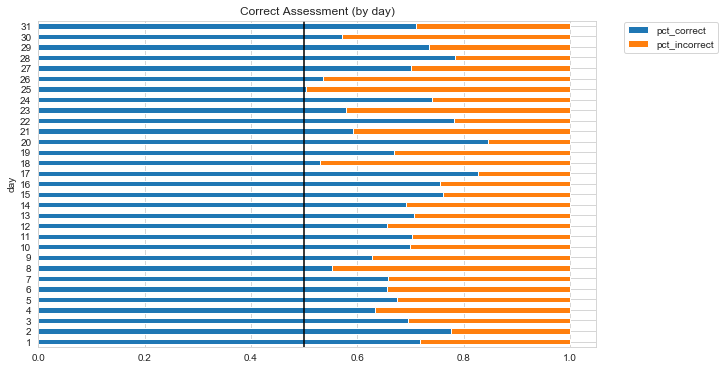


The feature 'hour' has the highest STD (0.14) among: 'day' (0.09), 'weekday' (0.03), 'month' (0.03)

## <font color='green'> Good cols: ```'hour'``` and perhaps ```'day'``` </font> 
### <font color='green'> ADD New cols!</font> 


```python
train['hour'] = train.timestamp.dt.hour
train['day'] = train.timestamp.dt.day
```

## 4) Type


```python
for game_type in set(train.type):
    print(game_type)
    pprint(list(set(train[train.type==game_type].title)))
```

    Activity
    ['Bottle Filler (Activity)',
     'Flower Waterer (Activity)',
     'Watering Hole (Activity)',
     'Egg Dropper (Activity)',
     'Fireworks (Activity)',
     'Bug Measurer (Activity)',
     'Sandcastle Builder (Activity)',
     'Chicken Balancer (Activity)']
    Assessment
    ['Cart Balancer (Assessment)',
     'Bird Measurer (Assessment)',
     'Mushroom Sorter (Assessment)',
     'Chest Sorter (Assessment)',
     'Cauldron Filler (Assessment)']
    Game
    ['Pan Balance',
     'All Star Sorting',
     'Scrub-A-Dub',
     'Bubble Bath',
     'Chow Time',
     'Happy Camel',
     'Dino Dive',
     'Air Show',
     'Leaf Leader',
     'Crystals Rule',
     'Dino Drink']


## <font color='red'>No new information in ```type```! <font>

## 5) Event_code 


```python
print("Fraction of unique event codes: {0}/{1}"\
      .format(len(set(train.event_code)-set(assessments.event_code)),
              len(set(train.event_code)))
     )
```

    Fraction of unique event codes: 20/42


```python
assess_ec = assessments.groupby(['event_code'])[['num_correct']]\
                          .agg(['count','sum', pct_corrects])

# Clean df
assess_ec.columns = ['num_assessments', 'num_correct', 'pct_correct']
assess_ec['pct_incorrect'] =  1 - assess_ec.pct_correct

assess_ec.loc[:,['pct_correct','pct_incorrect']]\
            .plot.barh(stacked=True,figsize=(10, 6), title='Correct Assessment (by event_code)')
plt.gca().legend(frameon=True,loc=(1.05,0.9))
plt.gca().axvline(x=0.5, ymin=0, ymax=1, color='black')

del assess_ec
```


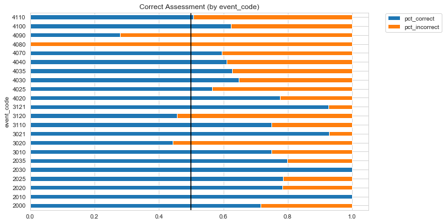


## <font color='green'> Good cols: ```'event_code'``` - values in assessments!!! </font> 

## 6) Event_id


```python
print("Fraction of unique Event IDs: {0}/{1}"\
      .format(len(set(train.event_id)-set(assessments.event_id)),
              len(set(train.event_id)))
     )
```

    Fraction of unique Event IDs: 273/366


```python
assess_ed = assessments.groupby('event_id')[['num_correct']]\
                       .agg(['count','sum', pct_corrects])

# Clean df
assess_ed.columns = ['num_assessments', 'num_correct', 'pct_correct']
assess_ed['pct_incorrect'] =  1 - assess_ed.pct_correct
assess_ed.index = [title.split('(')[0].strip() for title in assess_ed.index]

assess_ed.loc[:,['pct_correct']]\
         .plot(kind='hist' ,bins=30,edgecolor='white',
               figsize=(15,6),color=my_pal[1])

plt.gca().axvline(x=0.5, ymin=0, ymax=1, color='black')
plt.gcf().suptitle('Distribution of Event IDs vs % accuracy',fontsize = 18)


del assess_ed
```


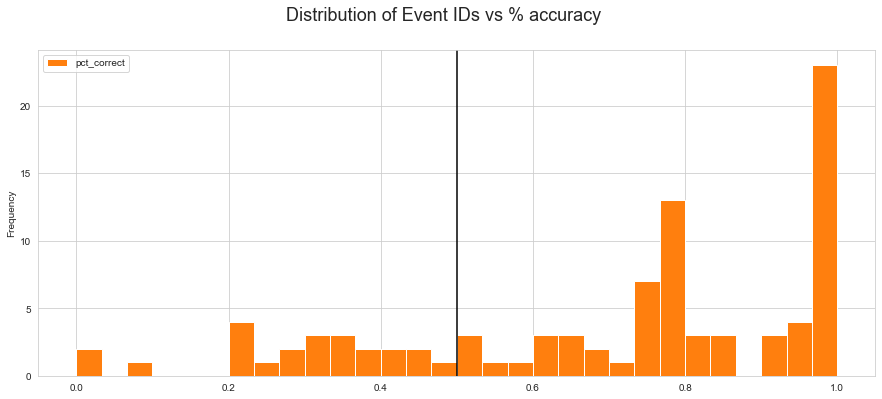


## <font color='blue'>Continuous Data<font>

## 7) Game_session 


```python
def no_unique_sessions(df, cut_off=1):
    
    return len(df[df.event_count>cut_off].reset_index()['game_session'].unique())
    
```


```python
cut_off = 1
uniq_sess_assess = no_unique_sessions(assessments)
uniq_sess_train = no_unique_sessions(train, cut_off=cut_off)
pct_fraction = round(uniq_sess_assess/uniq_sess_train*100,2)

print(f"""Fraction of unique assessment sessions vs train(cut_off): {uniq_sess_assess}/{uniq_sess_train} = {pct_fraction}%""")

```

    Fraction of unique assessment sessions vs train(cut_off): 1798/10994 = 16.35%


## 8) Game_time


```python
assessments.groupby(['installation_id','title'])[['game_time']].sum().unstack()[:10]
```


<div>
<style scoped>
    .dataframe tbody tr th:only-of-type {
        vertical-align: middle;
    }

    .dataframe tbody tr th {
        vertical-align: top;
    }

    .dataframe thead tr th {
        text-align: left;
    }

    .dataframe thead tr:last-of-type th {
        text-align: right;
    }
</style>
<table border="1" class="dataframe">
  <thead>
    <tr>
      <th></th>
      <th colspan="5" halign="left">game_time</th>
    </tr>
    <tr>
      <th>title</th>
      <th>Bird Measurer (Assessment)</th>
      <th>Cart Balancer (Assessment)</th>
      <th>Cauldron Filler (Assessment)</th>
      <th>Chest Sorter (Assessment)</th>
      <th>Mushroom Sorter (Assessment)</th>
    </tr>
    <tr>
      <th>installation_id</th>
      <th></th>
      <th></th>
      <th></th>
      <th></th>
      <th></th>
    </tr>
  </thead>
  <tbody>
    <tr>
      <td>435871</td>
      <td>78.52</td>
      <td>NaN</td>
      <td>NaN</td>
      <td>NaN</td>
      <td>28.77</td>
    </tr>
    <tr>
      <td>442770</td>
      <td>366.12</td>
      <td>NaN</td>
      <td>3.10</td>
      <td>NaN</td>
      <td>82.30</td>
    </tr>
    <tr>
      <td>1218646</td>
      <td>13.40</td>
      <td>NaN</td>
      <td>NaN</td>
      <td>NaN</td>
      <td>NaN</td>
    </tr>
    <tr>
      <td>1904336</td>
      <td>25.14</td>
      <td>2.09</td>
      <td>NaN</td>
      <td>8.53</td>
      <td>31.48</td>
    </tr>
    <tr>
      <td>2252647</td>
      <td>8.40</td>
      <td>NaN</td>
      <td>NaN</td>
      <td>NaN</td>
      <td>NaN</td>
    </tr>
    <tr>
      <td>2595525</td>
      <td>NaN</td>
      <td>NaN</td>
      <td>NaN</td>
      <td>199.90</td>
      <td>NaN</td>
    </tr>
    <tr>
      <td>2996195</td>
      <td>143.47</td>
      <td>11.62</td>
      <td>7.70</td>
      <td>62.32</td>
      <td>24.65</td>
    </tr>
    <tr>
      <td>3371696</td>
      <td>16.20</td>
      <td>14.04</td>
      <td>10.81</td>
      <td>32.10</td>
      <td>8.95</td>
    </tr>
    <tr>
      <td>4989073</td>
      <td>5.23</td>
      <td>NaN</td>
      <td>13.38</td>
      <td>NaN</td>
      <td>NaN</td>
    </tr>
    <tr>
      <td>6505523</td>
      <td>NaN</td>
      <td>6.76</td>
      <td>33.82</td>
      <td>49.94</td>
      <td>NaN</td>
    </tr>
  </tbody>
</table>
</div>


## 9) Event_count


```python
assess_ec = assessments.groupby('event_count')[['num_correct']]\
                       .agg(['count','sum', pct_corrects])

# Clean df
assess_ec.columns = ['num_assessments', 'num_correct', 'pct_correct']
assess_ec['pct_incorrect'] =  1 - assess_ec.pct_correct

assess_ec.loc[:,['pct_correct']]\
         .plot(kind='hist' ,bins=50,edgecolor='white',
               figsize=(15,6),color=my_pal[1])

plt.gca().axvline(x=0.5, ymin=0, ymax=1, color='black')
plt.gcf().suptitle('Distribution of Event Counts vs % accuracy',fontsize = 18)


del assess_ec
```


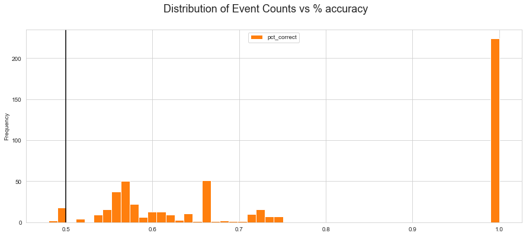


## <font color='blue'>Meta-Data<font>

## 10) Event_data


```python
for d in assessments.event_data.values[:10]:
    print(d)
```

    {'version': '1.0', 'event_count': 1, 'game_time': 0, 'event_code': 2000}
    {'event_count': 2, 'game_time': 77, 'event_code': 2025}
    {'description': 'Pull three mushrooms out of the ground and order them from shortest to tallest!', 'identifier': 'Dot_PullMushrooms', 'media_type': 'audio', 'total_duration': 3000, 'event_count': 3, 'game_time': 77, 'event_code': 3010}
    {'coordinates': {'x': 199, 'y': 484, 'stage_width': 1015, 'stage_height': 762}, 'event_count': 4, 'game_time': 2784, 'event_code': 4070}
    {'height': 1, 'coordinates': {'x': 171, 'y': 519, 'stage_width': 1015, 'stage_height': 762}, 'event_count': 5, 'game_time': 3625, 'event_code': 4025}
    {'description': 'Pull three mushrooms out of the ground and order them from shortest to tallest!', 'identifier': 'Dot_PullMushrooms', 'media_type': 'audio', 'duration': 3548, 'event_count': 6, 'game_time': 3625, 'event_code': 3110}
    {'description': "That's one!", 'identifier': 'Dot_ThatsOne', 'media_type': 'audio', 'total_duration': 600, 'event_count': 7, 'game_time': 3625, 'event_code': 3021}
    {'description': "That's one!", 'identifier': 'Dot_ThatsOne', 'media_type': 'audio', 'duration': 625, 'event_count': 8, 'game_time': 4250, 'event_code': 3121}
    {'height': 2, 'coordinates': {'x': 496, 'y': 502, 'stage_width': 1015, 'stage_height': 762}, 'event_count': 9, 'game_time': 4925, 'event_code': 4025}
    {'description': 'two...', 'identifier': 'Dot_Two', 'media_type': 'audio', 'total_duration': 510, 'event_count': 10, 'game_time': 4925, 'event_code': 3021}


# C. Feature Engineering

Let's first try to construct "domain-like" features which might correlate to user performance. Intuitively, I'll seek for features that somehow describe:

1. Level of game difficulty
2. User Expertise
3. User Focus 
4. Clarity of Game Instructions
5. Other

In particular, I'll use the continuous cols to construct aggregated feats.

## QUESTION: What pct of activities get completed and reach the assessment phase?

## C1. Game_time Aggregations
How much time do the app users spend:<br>
a) playing in general <br>
b) playing in a certain level (title) <br>
c) playing in a certain world <br>
d) on average per game session <br>
e) to complete a particular task <br>

### a) Net Game Time


```python
def net_time(df):
    
    return df.groupby('installation_id')[['game_time']]\
             .sum()\
             .rename({'game_time': 'net_time'}, axis=1)
```


```python
net_times = net_time(train)
```


```python
net_times.head()
```


<div>
<style scoped>
    .dataframe tbody tr th:only-of-type {
        vertical-align: middle;
    }

    .dataframe tbody tr th {
        vertical-align: top;
    }

    .dataframe thead th {
        text-align: right;
    }
</style>
<table border="1" class="dataframe">
  <thead>
    <tr style="text-align: right;">
      <th></th>
      <th>net_time</th>
    </tr>
    <tr>
      <th>installation_id</th>
      <th></th>
    </tr>
  </thead>
  <tbody>
    <tr>
      <td>125199</td>
      <td>4563.90</td>
    </tr>
    <tr>
      <td>280516</td>
      <td>244.44</td>
    </tr>
    <tr>
      <td>435871</td>
      <td>5225.76</td>
    </tr>
    <tr>
      <td>442770</td>
      <td>3350.47</td>
    </tr>
    <tr>
      <td>632233</td>
      <td>2736.90</td>
    </tr>
  </tbody>
</table>
</div>


```python
print('Number of ids with ZERO net_time : {0}/{1}'
      .format(np.sum(net_times['net_time']==0), 
              len(net_times))
     )
     
```

    Number of ids with ZERO net_time : 2/1119


```python
less_than = 1
print('Number of ids with net_time less than {0} min: {1}/{2}'
      .format(less_than, 
              np.sum(net_times['net_time']<less_than), 
              len(net_times))
     )
```

    Number of ids with net_time less than 1 min: 22/1119


```python
def plot_log_distribution(df, cut_off=1, title="Distribution of Log(net_time) with cut-off="):
   
    # filter out ids with net_time less than threshold (min)
    df = df[df.net_time > cut_off]
    df.apply(np.log)\
      .plot(kind='hist' ,bins=50,edgecolor='white',
            figsize=(15,6),color=my_pal[1])
    plt.gcf().suptitle(title+str(cut_off),fontsize = 18)
    plt.ylabel('num_ids', fontsize=18)
    
    return df.describe()
    
```


```python
plot_log_distribution(net_times)
```


<div>
<style scoped>
    .dataframe tbody tr th:only-of-type {
        vertical-align: middle;
    }

    .dataframe tbody tr th {
        vertical-align: top;
    }

    .dataframe thead th {
        text-align: right;
    }
</style>
<table border="1" class="dataframe">
  <thead>
    <tr style="text-align: right;">
      <th></th>
      <th>net_time</th>
    </tr>
  </thead>
  <tbody>
    <tr>
      <td>count</td>
      <td>1096.000000</td>
    </tr>
    <tr>
      <td>mean</td>
      <td>2456.108823</td>
    </tr>
    <tr>
      <td>std</td>
      <td>7321.960625</td>
    </tr>
    <tr>
      <td>min</td>
      <td>1.030000</td>
    </tr>
    <tr>
      <td>25%</td>
      <td>106.110000</td>
    </tr>
    <tr>
      <td>50%</td>
      <td>475.130000</td>
    </tr>
    <tr>
      <td>75%</td>
      <td>1748.597500</td>
    </tr>
    <tr>
      <td>max</td>
      <td>107002.490000</td>
    </tr>
  </tbody>
</table>
</div>


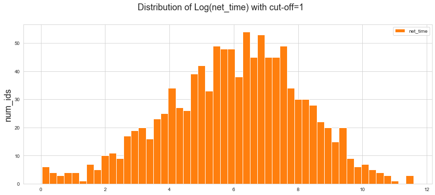


## <font color='green'> Good Features: ```net_time``` </font> 

Comments: 
- perhaps use log of net_time 
- treat differently ids with zero to less than a cut_off-value of game time


### b) Game Times Per Title


```python
def plot_barh_chart(df ,col):
    
    df = df.groupby(col)['game_time']\
           .sum()\
           .sort_values()
    
    df.plot(kind='barh',figsize=(10,6))
    plt.gcf().suptitle("Net Game Time Per " + col.title(), size = 18)
    plt.gca().set_ylabel(plt.gca().get_ylabel(), visible=False) #remove ylabel
    
    return df.describe()
```


```python
plot_barh_chart(train, col='title')
```


    count        24.000000
    mean     112162.643750
    std      109094.089271
    min        7983.320000
    25%       49515.712500
    50%       77829.115000
    75%      139781.872500
    max      435304.750000
    Name: game_time, dtype: float64


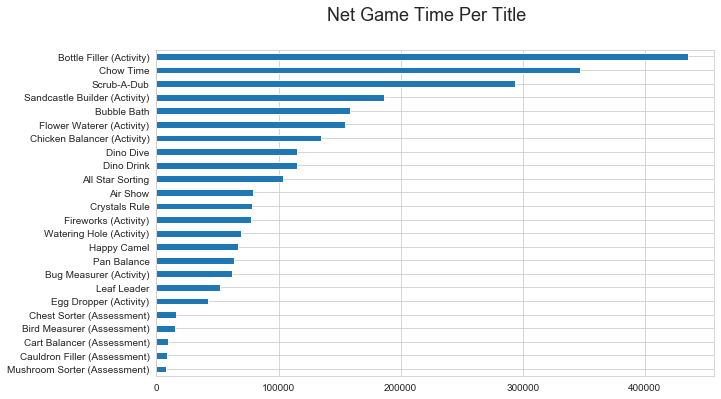


```python
def net_times_per_col(df, col):
    
    return train.groupby(['installation_id', col])[['game_time']]\
                .sum()\
                .rename({'game_time': 'net_time_per_' + col}, axis=1)\
                .unstack()\
                .fillna(0)
```


```python
net_times_per_col(train, col='title').head()
```


<div>
<style scoped>
    .dataframe tbody tr th:only-of-type {
        vertical-align: middle;
    }

    .dataframe tbody tr th {
        vertical-align: top;
    }

    .dataframe thead tr th {
        text-align: left;
    }

    .dataframe thead tr:last-of-type th {
        text-align: right;
    }
</style>
<table border="1" class="dataframe">
  <thead>
    <tr>
      <th></th>
      <th colspan="24" halign="left">net_time_per_title</th>
    </tr>
    <tr>
      <th>title</th>
      <th>Air Show</th>
      <th>All Star Sorting</th>
      <th>Bird Measurer (Assessment)</th>
      <th>Bottle Filler (Activity)</th>
      <th>Bubble Bath</th>
      <th>Bug Measurer (Activity)</th>
      <th>Cart Balancer (Assessment)</th>
      <th>Cauldron Filler (Assessment)</th>
      <th>Chest Sorter (Assessment)</th>
      <th>Chicken Balancer (Activity)</th>
      <th>Chow Time</th>
      <th>Crystals Rule</th>
      <th>Dino Dive</th>
      <th>Dino Drink</th>
      <th>Egg Dropper (Activity)</th>
      <th>Fireworks (Activity)</th>
      <th>Flower Waterer (Activity)</th>
      <th>Happy Camel</th>
      <th>Leaf Leader</th>
      <th>Mushroom Sorter (Assessment)</th>
      <th>Pan Balance</th>
      <th>Sandcastle Builder (Activity)</th>
      <th>Scrub-A-Dub</th>
      <th>Watering Hole (Activity)</th>
    </tr>
    <tr>
      <th>installation_id</th>
      <th></th>
      <th></th>
      <th></th>
      <th></th>
      <th></th>
      <th></th>
      <th></th>
      <th></th>
      <th></th>
      <th></th>
      <th></th>
      <th></th>
      <th></th>
      <th></th>
      <th></th>
      <th></th>
      <th></th>
      <th></th>
      <th></th>
      <th></th>
      <th></th>
      <th></th>
      <th></th>
      <th></th>
    </tr>
  </thead>
  <tbody>
    <tr>
      <td>125199</td>
      <td>0.00</td>
      <td>0.0</td>
      <td>0.00</td>
      <td>0.00</td>
      <td>0.00</td>
      <td>0.00</td>
      <td>0.0</td>
      <td>0.00</td>
      <td>0.0</td>
      <td>0.00</td>
      <td>0.00</td>
      <td>0.00</td>
      <td>0.00</td>
      <td>304.14</td>
      <td>0.0</td>
      <td>0.00</td>
      <td>0.00</td>
      <td>0.0</td>
      <td>0.0</td>
      <td>0.00</td>
      <td>0.00</td>
      <td>495.39</td>
      <td>3764.37</td>
      <td>0.00</td>
    </tr>
    <tr>
      <td>280516</td>
      <td>0.00</td>
      <td>0.0</td>
      <td>0.00</td>
      <td>0.00</td>
      <td>0.00</td>
      <td>0.00</td>
      <td>0.0</td>
      <td>0.00</td>
      <td>0.0</td>
      <td>0.00</td>
      <td>0.00</td>
      <td>0.00</td>
      <td>0.00</td>
      <td>193.02</td>
      <td>0.0</td>
      <td>0.00</td>
      <td>0.00</td>
      <td>0.0</td>
      <td>0.0</td>
      <td>0.00</td>
      <td>0.00</td>
      <td>0.00</td>
      <td>0.00</td>
      <td>51.42</td>
    </tr>
    <tr>
      <td>435871</td>
      <td>479.98</td>
      <td>124.6</td>
      <td>78.52</td>
      <td>622.83</td>
      <td>340.05</td>
      <td>270.66</td>
      <td>0.0</td>
      <td>0.00</td>
      <td>0.0</td>
      <td>0.00</td>
      <td>0.00</td>
      <td>381.35</td>
      <td>20.70</td>
      <td>301.65</td>
      <td>0.0</td>
      <td>1495.52</td>
      <td>339.12</td>
      <td>0.0</td>
      <td>0.0</td>
      <td>29.74</td>
      <td>0.00</td>
      <td>261.13</td>
      <td>378.24</td>
      <td>101.67</td>
    </tr>
    <tr>
      <td>442770</td>
      <td>0.00</td>
      <td>0.0</td>
      <td>366.12</td>
      <td>843.68</td>
      <td>137.03</td>
      <td>104.85</td>
      <td>0.0</td>
      <td>3.12</td>
      <td>0.0</td>
      <td>103.87</td>
      <td>51.25</td>
      <td>0.77</td>
      <td>238.11</td>
      <td>0.00</td>
      <td>0.0</td>
      <td>0.00</td>
      <td>452.06</td>
      <td>0.0</td>
      <td>0.0</td>
      <td>82.30</td>
      <td>1.23</td>
      <td>586.18</td>
      <td>371.76</td>
      <td>8.14</td>
    </tr>
    <tr>
      <td>632233</td>
      <td>0.00</td>
      <td>0.0</td>
      <td>0.00</td>
      <td>0.00</td>
      <td>0.00</td>
      <td>0.00</td>
      <td>0.0</td>
      <td>0.00</td>
      <td>0.0</td>
      <td>0.00</td>
      <td>0.00</td>
      <td>0.00</td>
      <td>2571.03</td>
      <td>0.00</td>
      <td>0.0</td>
      <td>0.00</td>
      <td>0.00</td>
      <td>0.0</td>
      <td>0.0</td>
      <td>0.00</td>
      <td>0.00</td>
      <td>115.61</td>
      <td>0.00</td>
      <td>50.26</td>
    </tr>
  </tbody>
</table>
</div>


## <font color='green'>  Good Features:  ```net_time_per_title```<font>

### c) Game Time per World


```python
plot_barh_chart(train, col='world')
```


    count    3.000000e+00
    mean     8.973012e+05
    std      4.259774e+05
    min      5.787693e+05
    25%      6.553723e+05
    50%      7.319752e+05
    75%      1.056567e+06
    max      1.381159e+06
    Name: game_time, dtype: float64


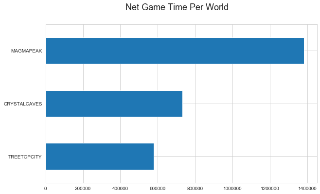


```python
net_times_per_col(train, col='world').head()
```


<div>
<style scoped>
    .dataframe tbody tr th:only-of-type {
        vertical-align: middle;
    }

    .dataframe tbody tr th {
        vertical-align: top;
    }

    .dataframe thead tr th {
        text-align: left;
    }

    .dataframe thead tr:last-of-type th {
        text-align: right;
    }
</style>
<table border="1" class="dataframe">
  <thead>
    <tr>
      <th></th>
      <th colspan="3" halign="left">net_time_per_world</th>
    </tr>
    <tr>
      <th>world</th>
      <th>CRYSTALCAVES</th>
      <th>MAGMAPEAK</th>
      <th>TREETOPCITY</th>
    </tr>
    <tr>
      <th>installation_id</th>
      <th></th>
      <th></th>
      <th></th>
    </tr>
  </thead>
  <tbody>
    <tr>
      <td>125199</td>
      <td>0.00</td>
      <td>4563.90</td>
      <td>0.00</td>
    </tr>
    <tr>
      <td>280516</td>
      <td>0.00</td>
      <td>244.44</td>
      <td>0.00</td>
    </tr>
    <tr>
      <td>435871</td>
      <td>0.00</td>
      <td>2026.27</td>
      <td>3199.49</td>
    </tr>
    <tr>
      <td>442770</td>
      <td>156.35</td>
      <td>2188.02</td>
      <td>1006.10</td>
    </tr>
    <tr>
      <td>632233</td>
      <td>0.00</td>
      <td>2736.90</td>
      <td>0.00</td>
    </tr>
  </tbody>
</table>
</div>


## <font color='green'>  Good Features:  ```net_time_per_world```<font>

COMMENT: Can also compute aggregates for event_counts, game_sessions, etc per title/world

### d) Avg Time Per Session


```python
def avg_time_per_sess(df):
    
    df = df.reset_index()\
           .groupby(['installation_id'])[['game_time','game_session']]\
           .agg({'game_time': 'sum',
                 'game_session': 'nunique'})
    
    df['avg_time_per_sess'] = df['game_time'] / df['game_session']
    
    return df[['avg_time_per_sess']].astype('int')

             
```


```python
avg_time_per_sess(train).head()
```


<div>
<style scoped>
    .dataframe tbody tr th:only-of-type {
        vertical-align: middle;
    }

    .dataframe tbody tr th {
        vertical-align: top;
    }

    .dataframe thead th {
        text-align: right;
    }
</style>
<table border="1" class="dataframe">
  <thead>
    <tr style="text-align: right;">
      <th></th>
      <th>avg_time_per_sess</th>
    </tr>
    <tr>
      <th>installation_id</th>
      <th></th>
    </tr>
  </thead>
  <tbody>
    <tr>
      <td>125199</td>
      <td>912</td>
    </tr>
    <tr>
      <td>280516</td>
      <td>122</td>
    </tr>
    <tr>
      <td>435871</td>
      <td>124</td>
    </tr>
    <tr>
      <td>442770</td>
      <td>186</td>
    </tr>
    <tr>
      <td>632233</td>
      <td>912</td>
    </tr>
  </tbody>
</table>
</div>


### e)  Time per task (Activity)


```python
train[train.type=="Activity"].head()
```


<div>
<style scoped>
    .dataframe tbody tr th:only-of-type {
        vertical-align: middle;
    }

    .dataframe tbody tr th {
        vertical-align: top;
    }

    .dataframe thead th {
        text-align: right;
    }
</style>
<table border="1" class="dataframe">
  <thead>
    <tr style="text-align: right;">
      <th></th>
      <th></th>
      <th>event_id</th>
      <th>timestamp</th>
      <th>event_data</th>
      <th>event_count</th>
      <th>event_code</th>
      <th>game_time</th>
      <th>title</th>
      <th>type</th>
      <th>world</th>
      <th>hour</th>
      <th>day</th>
    </tr>
    <tr>
      <th>installation_id</th>
      <th>game_session</th>
      <th></th>
      <th></th>
      <th></th>
      <th></th>
      <th></th>
      <th></th>
      <th></th>
      <th></th>
      <th></th>
      <th></th>
      <th></th>
    </tr>
  </thead>
  <tbody>
    <tr>
      <td rowspan="5" valign="top">125199</td>
      <td>0848ef14a8dc6892</td>
      <td>77261ab5</td>
      <td>2019-09-06 17:54:56.302000+00:00</td>
      <td>{'version': '1.0', 'event_count': 1, 'game_tim...</td>
      <td>1</td>
      <td>2000</td>
      <td>0.00</td>
      <td>Sandcastle Builder (Activity)</td>
      <td>Activity</td>
      <td>MAGMAPEAK</td>
      <td>17</td>
      <td>6</td>
    </tr>
    <tr>
      <td>0848ef14a8dc6892</td>
      <td>b2dba42b</td>
      <td>2019-09-06 17:54:56.387000+00:00</td>
      <td>{'description': 'Let's build a sandcastle! Fir...</td>
      <td>2</td>
      <td>3010</td>
      <td>0.00</td>
      <td>Sandcastle Builder (Activity)</td>
      <td>Activity</td>
      <td>MAGMAPEAK</td>
      <td>17</td>
      <td>6</td>
    </tr>
    <tr>
      <td>0848ef14a8dc6892</td>
      <td>1bb5fbdb</td>
      <td>2019-09-06 17:55:03.253000+00:00</td>
      <td>{'description': 'Let's build a sandcastle! Fir...</td>
      <td>3</td>
      <td>3110</td>
      <td>0.12</td>
      <td>Sandcastle Builder (Activity)</td>
      <td>Activity</td>
      <td>MAGMAPEAK</td>
      <td>17</td>
      <td>6</td>
    </tr>
    <tr>
      <td>0848ef14a8dc6892</td>
      <td>1325467d</td>
      <td>2019-09-06 17:55:06.279000+00:00</td>
      <td>{'coordinates': {'x': 583, 'y': 605, 'stage_wi...</td>
      <td>4</td>
      <td>4070</td>
      <td>0.17</td>
      <td>Sandcastle Builder (Activity)</td>
      <td>Activity</td>
      <td>MAGMAPEAK</td>
      <td>17</td>
      <td>6</td>
    </tr>
    <tr>
      <td>0848ef14a8dc6892</td>
      <td>1325467d</td>
      <td>2019-09-06 17:55:06.913000+00:00</td>
      <td>{'coordinates': {'x': 601, 'y': 570, 'stage_wi...</td>
      <td>5</td>
      <td>4070</td>
      <td>0.18</td>
      <td>Sandcastle Builder (Activity)</td>
      <td>Activity</td>
      <td>MAGMAPEAK</td>
      <td>17</td>
      <td>6</td>
    </tr>
  </tbody>
</table>
</div>


## C2. Game_session Aggregations

### a) Count Sessions Per Col


```python
def count_sess_per_col(df, col):
    
    return df.reset_index()\
             .groupby(['installation_id', col])[['game_session']]\
             .nunique()\
             .rename({'game_session': 'no_sess_per_' + col}, axis=1)\
             .unstack()\
             .fillna(0)
    

```


```python
count_sess_per_col(train, col='hour').head()
```


<div>
<style scoped>
    .dataframe tbody tr th:only-of-type {
        vertical-align: middle;
    }

    .dataframe tbody tr th {
        vertical-align: top;
    }

    .dataframe thead tr th {
        text-align: left;
    }

    .dataframe thead tr:last-of-type th {
        text-align: right;
    }
</style>
<table border="1" class="dataframe">
  <thead>
    <tr>
      <th></th>
      <th colspan="24" halign="left">no_sess_per_hour</th>
    </tr>
    <tr>
      <th>hour</th>
      <th>0</th>
      <th>1</th>
      <th>2</th>
      <th>3</th>
      <th>4</th>
      <th>5</th>
      <th>6</th>
      <th>7</th>
      <th>8</th>
      <th>9</th>
      <th>10</th>
      <th>11</th>
      <th>12</th>
      <th>13</th>
      <th>14</th>
      <th>15</th>
      <th>16</th>
      <th>17</th>
      <th>18</th>
      <th>19</th>
      <th>20</th>
      <th>21</th>
      <th>22</th>
      <th>23</th>
    </tr>
    <tr>
      <th>installation_id</th>
      <th></th>
      <th></th>
      <th></th>
      <th></th>
      <th></th>
      <th></th>
      <th></th>
      <th></th>
      <th></th>
      <th></th>
      <th></th>
      <th></th>
      <th></th>
      <th></th>
      <th></th>
      <th></th>
      <th></th>
      <th></th>
      <th></th>
      <th></th>
      <th></th>
      <th></th>
      <th></th>
      <th></th>
    </tr>
  </thead>
  <tbody>
    <tr>
      <td>125199</td>
      <td>0.0</td>
      <td>0.0</td>
      <td>0.0</td>
      <td>0.0</td>
      <td>0.0</td>
      <td>0.0</td>
      <td>0.0</td>
      <td>0.0</td>
      <td>0.0</td>
      <td>0.0</td>
      <td>0.0</td>
      <td>0.0</td>
      <td>0.0</td>
      <td>0.0</td>
      <td>0.0</td>
      <td>0.0</td>
      <td>0.0</td>
      <td>2.0</td>
      <td>3.0</td>
      <td>0.0</td>
      <td>0.0</td>
      <td>0.0</td>
      <td>0.0</td>
      <td>0.0</td>
    </tr>
    <tr>
      <td>280516</td>
      <td>0.0</td>
      <td>0.0</td>
      <td>0.0</td>
      <td>0.0</td>
      <td>0.0</td>
      <td>0.0</td>
      <td>0.0</td>
      <td>0.0</td>
      <td>0.0</td>
      <td>0.0</td>
      <td>0.0</td>
      <td>0.0</td>
      <td>0.0</td>
      <td>0.0</td>
      <td>1.0</td>
      <td>1.0</td>
      <td>0.0</td>
      <td>0.0</td>
      <td>0.0</td>
      <td>0.0</td>
      <td>0.0</td>
      <td>0.0</td>
      <td>0.0</td>
      <td>0.0</td>
    </tr>
    <tr>
      <td>435871</td>
      <td>0.0</td>
      <td>0.0</td>
      <td>0.0</td>
      <td>0.0</td>
      <td>1.0</td>
      <td>18.0</td>
      <td>0.0</td>
      <td>0.0</td>
      <td>0.0</td>
      <td>0.0</td>
      <td>0.0</td>
      <td>0.0</td>
      <td>0.0</td>
      <td>0.0</td>
      <td>0.0</td>
      <td>0.0</td>
      <td>8.0</td>
      <td>2.0</td>
      <td>6.0</td>
      <td>0.0</td>
      <td>8.0</td>
      <td>0.0</td>
      <td>0.0</td>
      <td>0.0</td>
    </tr>
    <tr>
      <td>442770</td>
      <td>6.0</td>
      <td>1.0</td>
      <td>0.0</td>
      <td>0.0</td>
      <td>0.0</td>
      <td>0.0</td>
      <td>0.0</td>
      <td>0.0</td>
      <td>0.0</td>
      <td>0.0</td>
      <td>0.0</td>
      <td>0.0</td>
      <td>0.0</td>
      <td>2.0</td>
      <td>0.0</td>
      <td>10.0</td>
      <td>0.0</td>
      <td>0.0</td>
      <td>0.0</td>
      <td>0.0</td>
      <td>0.0</td>
      <td>0.0</td>
      <td>0.0</td>
      <td>0.0</td>
    </tr>
    <tr>
      <td>632233</td>
      <td>0.0</td>
      <td>0.0</td>
      <td>0.0</td>
      <td>0.0</td>
      <td>0.0</td>
      <td>0.0</td>
      <td>0.0</td>
      <td>0.0</td>
      <td>0.0</td>
      <td>0.0</td>
      <td>0.0</td>
      <td>0.0</td>
      <td>0.0</td>
      <td>0.0</td>
      <td>0.0</td>
      <td>0.0</td>
      <td>0.0</td>
      <td>0.0</td>
      <td>3.0</td>
      <td>1.0</td>
      <td>0.0</td>
      <td>0.0</td>
      <td>0.0</td>
      <td>0.0</td>
    </tr>
  </tbody>
</table>
</div>


```python
count_sess_per_col(train, col='day').head()
```


<div>
<style scoped>
    .dataframe tbody tr th:only-of-type {
        vertical-align: middle;
    }

    .dataframe tbody tr th {
        vertical-align: top;
    }

    .dataframe thead tr th {
        text-align: left;
    }

    .dataframe thead tr:last-of-type th {
        text-align: right;
    }
</style>
<table border="1" class="dataframe">
  <thead>
    <tr>
      <th></th>
      <th colspan="31" halign="left">no_sess_per_day</th>
    </tr>
    <tr>
      <th>day</th>
      <th>1</th>
      <th>2</th>
      <th>3</th>
      <th>4</th>
      <th>5</th>
      <th>6</th>
      <th>7</th>
      <th>8</th>
      <th>9</th>
      <th>10</th>
      <th>11</th>
      <th>12</th>
      <th>13</th>
      <th>14</th>
      <th>15</th>
      <th>16</th>
      <th>17</th>
      <th>18</th>
      <th>19</th>
      <th>20</th>
      <th>21</th>
      <th>22</th>
      <th>23</th>
      <th>24</th>
      <th>25</th>
      <th>26</th>
      <th>27</th>
      <th>28</th>
      <th>29</th>
      <th>30</th>
      <th>31</th>
    </tr>
    <tr>
      <th>installation_id</th>
      <th></th>
      <th></th>
      <th></th>
      <th></th>
      <th></th>
      <th></th>
      <th></th>
      <th></th>
      <th></th>
      <th></th>
      <th></th>
      <th></th>
      <th></th>
      <th></th>
      <th></th>
      <th></th>
      <th></th>
      <th></th>
      <th></th>
      <th></th>
      <th></th>
      <th></th>
      <th></th>
      <th></th>
      <th></th>
      <th></th>
      <th></th>
      <th></th>
      <th></th>
      <th></th>
      <th></th>
    </tr>
  </thead>
  <tbody>
    <tr>
      <td>125199</td>
      <td>0.0</td>
      <td>0.0</td>
      <td>0.0</td>
      <td>0.0</td>
      <td>0.0</td>
      <td>5.0</td>
      <td>0.0</td>
      <td>0.0</td>
      <td>0.0</td>
      <td>0.0</td>
      <td>0.0</td>
      <td>0.0</td>
      <td>0.0</td>
      <td>0.0</td>
      <td>0.0</td>
      <td>0.0</td>
      <td>0.0</td>
      <td>0.0</td>
      <td>0.0</td>
      <td>0.0</td>
      <td>0.0</td>
      <td>0.0</td>
      <td>0.0</td>
      <td>0.0</td>
      <td>0.0</td>
      <td>0.0</td>
      <td>0.0</td>
      <td>0.0</td>
      <td>0.0</td>
      <td>0.0</td>
      <td>0.0</td>
    </tr>
    <tr>
      <td>280516</td>
      <td>0.0</td>
      <td>0.0</td>
      <td>0.0</td>
      <td>0.0</td>
      <td>0.0</td>
      <td>0.0</td>
      <td>0.0</td>
      <td>0.0</td>
      <td>0.0</td>
      <td>0.0</td>
      <td>2.0</td>
      <td>0.0</td>
      <td>0.0</td>
      <td>0.0</td>
      <td>0.0</td>
      <td>0.0</td>
      <td>0.0</td>
      <td>0.0</td>
      <td>0.0</td>
      <td>0.0</td>
      <td>0.0</td>
      <td>0.0</td>
      <td>0.0</td>
      <td>0.0</td>
      <td>0.0</td>
      <td>0.0</td>
      <td>0.0</td>
      <td>0.0</td>
      <td>0.0</td>
      <td>0.0</td>
      <td>0.0</td>
    </tr>
    <tr>
      <td>435871</td>
      <td>0.0</td>
      <td>0.0</td>
      <td>0.0</td>
      <td>0.0</td>
      <td>0.0</td>
      <td>29.0</td>
      <td>0.0</td>
      <td>0.0</td>
      <td>5.0</td>
      <td>0.0</td>
      <td>0.0</td>
      <td>0.0</td>
      <td>0.0</td>
      <td>0.0</td>
      <td>0.0</td>
      <td>0.0</td>
      <td>0.0</td>
      <td>0.0</td>
      <td>0.0</td>
      <td>0.0</td>
      <td>0.0</td>
      <td>0.0</td>
      <td>0.0</td>
      <td>0.0</td>
      <td>0.0</td>
      <td>0.0</td>
      <td>0.0</td>
      <td>0.0</td>
      <td>8.0</td>
      <td>0.0</td>
      <td>0.0</td>
    </tr>
    <tr>
      <td>442770</td>
      <td>4.0</td>
      <td>0.0</td>
      <td>0.0</td>
      <td>0.0</td>
      <td>0.0</td>
      <td>0.0</td>
      <td>0.0</td>
      <td>0.0</td>
      <td>0.0</td>
      <td>0.0</td>
      <td>0.0</td>
      <td>0.0</td>
      <td>2.0</td>
      <td>10.0</td>
      <td>0.0</td>
      <td>0.0</td>
      <td>0.0</td>
      <td>0.0</td>
      <td>0.0</td>
      <td>2.0</td>
      <td>0.0</td>
      <td>0.0</td>
      <td>0.0</td>
      <td>0.0</td>
      <td>0.0</td>
      <td>0.0</td>
      <td>0.0</td>
      <td>0.0</td>
      <td>0.0</td>
      <td>0.0</td>
      <td>0.0</td>
    </tr>
    <tr>
      <td>632233</td>
      <td>0.0</td>
      <td>0.0</td>
      <td>0.0</td>
      <td>0.0</td>
      <td>0.0</td>
      <td>0.0</td>
      <td>0.0</td>
      <td>0.0</td>
      <td>0.0</td>
      <td>0.0</td>
      <td>3.0</td>
      <td>0.0</td>
      <td>0.0</td>
      <td>0.0</td>
      <td>0.0</td>
      <td>0.0</td>
      <td>0.0</td>
      <td>0.0</td>
      <td>0.0</td>
      <td>0.0</td>
      <td>0.0</td>
      <td>0.0</td>
      <td>0.0</td>
      <td>0.0</td>
      <td>0.0</td>
      <td>0.0</td>
      <td>0.0</td>
      <td>0.0</td>
      <td>0.0</td>
      <td>0.0</td>
      <td>0.0</td>
    </tr>
  </tbody>
</table>
</div>


```python
count_sess_per_col(train, col='world').head()
```


<div>
<style scoped>
    .dataframe tbody tr th:only-of-type {
        vertical-align: middle;
    }

    .dataframe tbody tr th {
        vertical-align: top;
    }

    .dataframe thead tr th {
        text-align: left;
    }

    .dataframe thead tr:last-of-type th {
        text-align: right;
    }
</style>
<table border="1" class="dataframe">
  <thead>
    <tr>
      <th></th>
      <th colspan="3" halign="left">no_sess_per_world</th>
    </tr>
    <tr>
      <th>world</th>
      <th>CRYSTALCAVES</th>
      <th>MAGMAPEAK</th>
      <th>TREETOPCITY</th>
    </tr>
    <tr>
      <th>installation_id</th>
      <th></th>
      <th></th>
      <th></th>
    </tr>
  </thead>
  <tbody>
    <tr>
      <td>125199</td>
      <td>0.0</td>
      <td>5.0</td>
      <td>0.0</td>
    </tr>
    <tr>
      <td>280516</td>
      <td>0.0</td>
      <td>2.0</td>
      <td>0.0</td>
    </tr>
    <tr>
      <td>435871</td>
      <td>0.0</td>
      <td>22.0</td>
      <td>20.0</td>
    </tr>
    <tr>
      <td>442770</td>
      <td>3.0</td>
      <td>10.0</td>
      <td>5.0</td>
    </tr>
    <tr>
      <td>632233</td>
      <td>0.0</td>
      <td>3.0</td>
      <td>0.0</td>
    </tr>
  </tbody>
</table>
</div>


```python
count_sess_per_col(train, col='title').head()
```


<div>
<style scoped>
    .dataframe tbody tr th:only-of-type {
        vertical-align: middle;
    }

    .dataframe tbody tr th {
        vertical-align: top;
    }

    .dataframe thead tr th {
        text-align: left;
    }

    .dataframe thead tr:last-of-type th {
        text-align: right;
    }
</style>
<table border="1" class="dataframe">
  <thead>
    <tr>
      <th></th>
      <th colspan="24" halign="left">no_sess_per_title</th>
    </tr>
    <tr>
      <th>title</th>
      <th>Air Show</th>
      <th>All Star Sorting</th>
      <th>Bird Measurer (Assessment)</th>
      <th>Bottle Filler (Activity)</th>
      <th>Bubble Bath</th>
      <th>Bug Measurer (Activity)</th>
      <th>Cart Balancer (Assessment)</th>
      <th>Cauldron Filler (Assessment)</th>
      <th>Chest Sorter (Assessment)</th>
      <th>Chicken Balancer (Activity)</th>
      <th>Chow Time</th>
      <th>Crystals Rule</th>
      <th>Dino Dive</th>
      <th>Dino Drink</th>
      <th>Egg Dropper (Activity)</th>
      <th>Fireworks (Activity)</th>
      <th>Flower Waterer (Activity)</th>
      <th>Happy Camel</th>
      <th>Leaf Leader</th>
      <th>Mushroom Sorter (Assessment)</th>
      <th>Pan Balance</th>
      <th>Sandcastle Builder (Activity)</th>
      <th>Scrub-A-Dub</th>
      <th>Watering Hole (Activity)</th>
    </tr>
    <tr>
      <th>installation_id</th>
      <th></th>
      <th></th>
      <th></th>
      <th></th>
      <th></th>
      <th></th>
      <th></th>
      <th></th>
      <th></th>
      <th></th>
      <th></th>
      <th></th>
      <th></th>
      <th></th>
      <th></th>
      <th></th>
      <th></th>
      <th></th>
      <th></th>
      <th></th>
      <th></th>
      <th></th>
      <th></th>
      <th></th>
    </tr>
  </thead>
  <tbody>
    <tr>
      <td>125199</td>
      <td>0.0</td>
      <td>0.0</td>
      <td>0.0</td>
      <td>0.0</td>
      <td>0.0</td>
      <td>0.0</td>
      <td>0.0</td>
      <td>0.0</td>
      <td>0.0</td>
      <td>0.0</td>
      <td>0.0</td>
      <td>0.0</td>
      <td>0.0</td>
      <td>1.0</td>
      <td>0.0</td>
      <td>0.0</td>
      <td>0.0</td>
      <td>0.0</td>
      <td>0.0</td>
      <td>0.0</td>
      <td>0.0</td>
      <td>3.0</td>
      <td>1.0</td>
      <td>0.0</td>
    </tr>
    <tr>
      <td>280516</td>
      <td>0.0</td>
      <td>0.0</td>
      <td>0.0</td>
      <td>0.0</td>
      <td>0.0</td>
      <td>0.0</td>
      <td>0.0</td>
      <td>0.0</td>
      <td>0.0</td>
      <td>0.0</td>
      <td>0.0</td>
      <td>0.0</td>
      <td>0.0</td>
      <td>1.0</td>
      <td>0.0</td>
      <td>0.0</td>
      <td>0.0</td>
      <td>0.0</td>
      <td>0.0</td>
      <td>0.0</td>
      <td>0.0</td>
      <td>0.0</td>
      <td>0.0</td>
      <td>1.0</td>
    </tr>
    <tr>
      <td>435871</td>
      <td>2.0</td>
      <td>4.0</td>
      <td>2.0</td>
      <td>2.0</td>
      <td>2.0</td>
      <td>2.0</td>
      <td>0.0</td>
      <td>0.0</td>
      <td>0.0</td>
      <td>0.0</td>
      <td>0.0</td>
      <td>2.0</td>
      <td>2.0</td>
      <td>3.0</td>
      <td>0.0</td>
      <td>2.0</td>
      <td>2.0</td>
      <td>0.0</td>
      <td>0.0</td>
      <td>4.0</td>
      <td>0.0</td>
      <td>6.0</td>
      <td>4.0</td>
      <td>3.0</td>
    </tr>
    <tr>
      <td>442770</td>
      <td>0.0</td>
      <td>0.0</td>
      <td>1.0</td>
      <td>1.0</td>
      <td>1.0</td>
      <td>1.0</td>
      <td>0.0</td>
      <td>2.0</td>
      <td>0.0</td>
      <td>1.0</td>
      <td>1.0</td>
      <td>1.0</td>
      <td>1.0</td>
      <td>0.0</td>
      <td>0.0</td>
      <td>0.0</td>
      <td>1.0</td>
      <td>0.0</td>
      <td>0.0</td>
      <td>1.0</td>
      <td>1.0</td>
      <td>3.0</td>
      <td>1.0</td>
      <td>1.0</td>
    </tr>
    <tr>
      <td>632233</td>
      <td>0.0</td>
      <td>0.0</td>
      <td>0.0</td>
      <td>0.0</td>
      <td>0.0</td>
      <td>0.0</td>
      <td>0.0</td>
      <td>0.0</td>
      <td>0.0</td>
      <td>0.0</td>
      <td>0.0</td>
      <td>0.0</td>
      <td>1.0</td>
      <td>0.0</td>
      <td>0.0</td>
      <td>0.0</td>
      <td>0.0</td>
      <td>0.0</td>
      <td>0.0</td>
      <td>0.0</td>
      <td>0.0</td>
      <td>1.0</td>
      <td>0.0</td>
      <td>1.0</td>
    </tr>
  </tbody>
</table>
</div>


## <font color='green'>  Good Features:  ```no_sess_per_col```<font>
```col = ['hour', 'day', 'title', 'world']```

### b) 

## <font color='green'>  Good Features:  ```time_per_sess, events_per_sess, avg_time_per_sess```<font>

### c) How often do they sign in AND play? And Why?

## C3. Event_code Aggregations


```python
def count_codes_per_col(df, col):
    
    return df.reset_index()\
             .groupby(['installation_id', col])[['event_code']]\
             .nunique()\
             .rename({'event_code': 'no_codes_per_' + col}, axis=1)\
             .unstack()\
             .fillna(0)
```


```python
count_codes_per_col(train, 'world').head()
```


<div>
<style scoped>
    .dataframe tbody tr th:only-of-type {
        vertical-align: middle;
    }

    .dataframe tbody tr th {
        vertical-align: top;
    }

    .dataframe thead tr th {
        text-align: left;
    }

    .dataframe thead tr:last-of-type th {
        text-align: right;
    }
</style>
<table border="1" class="dataframe">
  <thead>
    <tr>
      <th></th>
      <th colspan="3" halign="left">no_codes_per_world</th>
    </tr>
    <tr>
      <th>world</th>
      <th>CRYSTALCAVES</th>
      <th>MAGMAPEAK</th>
      <th>TREETOPCITY</th>
    </tr>
    <tr>
      <th>installation_id</th>
      <th></th>
      <th></th>
      <th></th>
    </tr>
  </thead>
  <tbody>
    <tr>
      <td>125199</td>
      <td>0.0</td>
      <td>23.0</td>
      <td>0.0</td>
    </tr>
    <tr>
      <td>280516</td>
      <td>0.0</td>
      <td>19.0</td>
      <td>0.0</td>
    </tr>
    <tr>
      <td>435871</td>
      <td>0.0</td>
      <td>36.0</td>
      <td>26.0</td>
    </tr>
    <tr>
      <td>442770</td>
      <td>16.0</td>
      <td>32.0</td>
      <td>22.0</td>
    </tr>
    <tr>
      <td>632233</td>
      <td>0.0</td>
      <td>21.0</td>
      <td>0.0</td>
    </tr>
  </tbody>
</table>
</div>


```python
count_codes_per_col(train, 'title').head()
```


<div>
<style scoped>
    .dataframe tbody tr th:only-of-type {
        vertical-align: middle;
    }

    .dataframe tbody tr th {
        vertical-align: top;
    }

    .dataframe thead tr th {
        text-align: left;
    }

    .dataframe thead tr:last-of-type th {
        text-align: right;
    }
</style>
<table border="1" class="dataframe">
  <thead>
    <tr>
      <th></th>
      <th colspan="24" halign="left">no_codes_per_title</th>
    </tr>
    <tr>
      <th>title</th>
      <th>Air Show</th>
      <th>All Star Sorting</th>
      <th>Bird Measurer (Assessment)</th>
      <th>Bottle Filler (Activity)</th>
      <th>Bubble Bath</th>
      <th>Bug Measurer (Activity)</th>
      <th>Cart Balancer (Assessment)</th>
      <th>Cauldron Filler (Assessment)</th>
      <th>Chest Sorter (Assessment)</th>
      <th>Chicken Balancer (Activity)</th>
      <th>Chow Time</th>
      <th>Crystals Rule</th>
      <th>Dino Dive</th>
      <th>Dino Drink</th>
      <th>Egg Dropper (Activity)</th>
      <th>Fireworks (Activity)</th>
      <th>Flower Waterer (Activity)</th>
      <th>Happy Camel</th>
      <th>Leaf Leader</th>
      <th>Mushroom Sorter (Assessment)</th>
      <th>Pan Balance</th>
      <th>Sandcastle Builder (Activity)</th>
      <th>Scrub-A-Dub</th>
      <th>Watering Hole (Activity)</th>
    </tr>
    <tr>
      <th>installation_id</th>
      <th></th>
      <th></th>
      <th></th>
      <th></th>
      <th></th>
      <th></th>
      <th></th>
      <th></th>
      <th></th>
      <th></th>
      <th></th>
      <th></th>
      <th></th>
      <th></th>
      <th></th>
      <th></th>
      <th></th>
      <th></th>
      <th></th>
      <th></th>
      <th></th>
      <th></th>
      <th></th>
      <th></th>
    </tr>
  </thead>
  <tbody>
    <tr>
      <td>125199</td>
      <td>0.0</td>
      <td>0.0</td>
      <td>0.0</td>
      <td>0.0</td>
      <td>0.0</td>
      <td>0.0</td>
      <td>0.0</td>
      <td>0.0</td>
      <td>0.0</td>
      <td>0.0</td>
      <td>0.0</td>
      <td>0.0</td>
      <td>0.0</td>
      <td>16.0</td>
      <td>0.0</td>
      <td>0.0</td>
      <td>0.0</td>
      <td>0.0</td>
      <td>0.0</td>
      <td>0.0</td>
      <td>0.0</td>
      <td>9.0</td>
      <td>16.0</td>
      <td>0.0</td>
    </tr>
    <tr>
      <td>280516</td>
      <td>0.0</td>
      <td>0.0</td>
      <td>0.0</td>
      <td>0.0</td>
      <td>0.0</td>
      <td>0.0</td>
      <td>0.0</td>
      <td>0.0</td>
      <td>0.0</td>
      <td>0.0</td>
      <td>0.0</td>
      <td>0.0</td>
      <td>0.0</td>
      <td>14.0</td>
      <td>0.0</td>
      <td>0.0</td>
      <td>0.0</td>
      <td>0.0</td>
      <td>0.0</td>
      <td>0.0</td>
      <td>0.0</td>
      <td>0.0</td>
      <td>0.0</td>
      <td>10.0</td>
    </tr>
    <tr>
      <td>435871</td>
      <td>17.0</td>
      <td>16.0</td>
      <td>16.0</td>
      <td>9.0</td>
      <td>22.0</td>
      <td>7.0</td>
      <td>0.0</td>
      <td>0.0</td>
      <td>0.0</td>
      <td>0.0</td>
      <td>0.0</td>
      <td>12.0</td>
      <td>6.0</td>
      <td>17.0</td>
      <td>0.0</td>
      <td>6.0</td>
      <td>8.0</td>
      <td>0.0</td>
      <td>0.0</td>
      <td>18.0</td>
      <td>0.0</td>
      <td>9.0</td>
      <td>17.0</td>
      <td>9.0</td>
    </tr>
    <tr>
      <td>442770</td>
      <td>0.0</td>
      <td>0.0</td>
      <td>18.0</td>
      <td>9.0</td>
      <td>20.0</td>
      <td>7.0</td>
      <td>0.0</td>
      <td>11.0</td>
      <td>0.0</td>
      <td>9.0</td>
      <td>14.0</td>
      <td>4.0</td>
      <td>14.0</td>
      <td>0.0</td>
      <td>0.0</td>
      <td>0.0</td>
      <td>8.0</td>
      <td>0.0</td>
      <td>0.0</td>
      <td>16.0</td>
      <td>4.0</td>
      <td>9.0</td>
      <td>17.0</td>
      <td>4.0</td>
    </tr>
    <tr>
      <td>632233</td>
      <td>0.0</td>
      <td>0.0</td>
      <td>0.0</td>
      <td>0.0</td>
      <td>0.0</td>
      <td>0.0</td>
      <td>0.0</td>
      <td>0.0</td>
      <td>0.0</td>
      <td>0.0</td>
      <td>0.0</td>
      <td>0.0</td>
      <td>15.0</td>
      <td>0.0</td>
      <td>0.0</td>
      <td>0.0</td>
      <td>0.0</td>
      <td>0.0</td>
      <td>0.0</td>
      <td>0.0</td>
      <td>0.0</td>
      <td>8.0</td>
      <td>0.0</td>
      <td>9.0</td>
    </tr>
  </tbody>
</table>
</div>


```python
count_codes_per_col(train, 'hour').head()
```


<div>
<style scoped>
    .dataframe tbody tr th:only-of-type {
        vertical-align: middle;
    }

    .dataframe tbody tr th {
        vertical-align: top;
    }

    .dataframe thead tr th {
        text-align: left;
    }

    .dataframe thead tr:last-of-type th {
        text-align: right;
    }
</style>
<table border="1" class="dataframe">
  <thead>
    <tr>
      <th></th>
      <th colspan="24" halign="left">no_codes_per_hour</th>
    </tr>
    <tr>
      <th>hour</th>
      <th>0</th>
      <th>1</th>
      <th>2</th>
      <th>3</th>
      <th>4</th>
      <th>5</th>
      <th>6</th>
      <th>7</th>
      <th>8</th>
      <th>9</th>
      <th>10</th>
      <th>11</th>
      <th>12</th>
      <th>13</th>
      <th>14</th>
      <th>15</th>
      <th>16</th>
      <th>17</th>
      <th>18</th>
      <th>19</th>
      <th>20</th>
      <th>21</th>
      <th>22</th>
      <th>23</th>
    </tr>
    <tr>
      <th>installation_id</th>
      <th></th>
      <th></th>
      <th></th>
      <th></th>
      <th></th>
      <th></th>
      <th></th>
      <th></th>
      <th></th>
      <th></th>
      <th></th>
      <th></th>
      <th></th>
      <th></th>
      <th></th>
      <th></th>
      <th></th>
      <th></th>
      <th></th>
      <th></th>
      <th></th>
      <th></th>
      <th></th>
      <th></th>
    </tr>
  </thead>
  <tbody>
    <tr>
      <td>125199</td>
      <td>0.0</td>
      <td>0.0</td>
      <td>0.0</td>
      <td>0.0</td>
      <td>0.0</td>
      <td>0.0</td>
      <td>0.0</td>
      <td>0.0</td>
      <td>0.0</td>
      <td>0.0</td>
      <td>0.0</td>
      <td>0.0</td>
      <td>0.0</td>
      <td>0.0</td>
      <td>0.0</td>
      <td>0.0</td>
      <td>0.0</td>
      <td>9.0</td>
      <td>22.0</td>
      <td>0.0</td>
      <td>0.0</td>
      <td>0.0</td>
      <td>0.0</td>
      <td>0.0</td>
    </tr>
    <tr>
      <td>280516</td>
      <td>0.0</td>
      <td>0.0</td>
      <td>0.0</td>
      <td>0.0</td>
      <td>0.0</td>
      <td>0.0</td>
      <td>0.0</td>
      <td>0.0</td>
      <td>0.0</td>
      <td>0.0</td>
      <td>0.0</td>
      <td>0.0</td>
      <td>0.0</td>
      <td>0.0</td>
      <td>10.0</td>
      <td>14.0</td>
      <td>0.0</td>
      <td>0.0</td>
      <td>0.0</td>
      <td>0.0</td>
      <td>0.0</td>
      <td>0.0</td>
      <td>0.0</td>
      <td>0.0</td>
    </tr>
    <tr>
      <td>435871</td>
      <td>0.0</td>
      <td>0.0</td>
      <td>0.0</td>
      <td>0.0</td>
      <td>8.0</td>
      <td>37.0</td>
      <td>0.0</td>
      <td>0.0</td>
      <td>0.0</td>
      <td>0.0</td>
      <td>0.0</td>
      <td>0.0</td>
      <td>0.0</td>
      <td>0.0</td>
      <td>0.0</td>
      <td>0.0</td>
      <td>34.0</td>
      <td>11.0</td>
      <td>26.0</td>
      <td>0.0</td>
      <td>25.0</td>
      <td>0.0</td>
      <td>0.0</td>
      <td>0.0</td>
    </tr>
    <tr>
      <td>442770</td>
      <td>23.0</td>
      <td>11.0</td>
      <td>0.0</td>
      <td>0.0</td>
      <td>0.0</td>
      <td>0.0</td>
      <td>0.0</td>
      <td>0.0</td>
      <td>0.0</td>
      <td>0.0</td>
      <td>0.0</td>
      <td>0.0</td>
      <td>0.0</td>
      <td>11.0</td>
      <td>0.0</td>
      <td>33.0</td>
      <td>0.0</td>
      <td>0.0</td>
      <td>0.0</td>
      <td>0.0</td>
      <td>0.0</td>
      <td>0.0</td>
      <td>0.0</td>
      <td>0.0</td>
    </tr>
    <tr>
      <td>632233</td>
      <td>0.0</td>
      <td>0.0</td>
      <td>0.0</td>
      <td>0.0</td>
      <td>0.0</td>
      <td>0.0</td>
      <td>0.0</td>
      <td>0.0</td>
      <td>0.0</td>
      <td>0.0</td>
      <td>0.0</td>
      <td>0.0</td>
      <td>0.0</td>
      <td>0.0</td>
      <td>0.0</td>
      <td>0.0</td>
      <td>0.0</td>
      <td>0.0</td>
      <td>20.0</td>
      <td>9.0</td>
      <td>0.0</td>
      <td>0.0</td>
      <td>0.0</td>
      <td>0.0</td>
    </tr>
  </tbody>
</table>
</div>


## 4. Clarity of game instructions

Game Clarity:<br>
a) rate hints based on user performance <br>
b) check if the user was doing something weird: from coords (e.g. false negatives) <br>
c) check if the user was doing something weird to familiarize himself/herself with the game (e.g. at the beginnig might press randomly)

