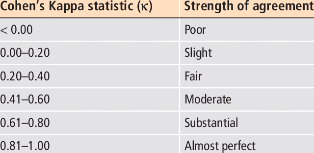

# Intro:

Recall that in the previous [post](https://vasilis-stylianou.github.io/ML_Kaggle_DSB_1/) I set up the problem of predicting the accuracy of a user completing an in-app assessment, for the Kaggle competition: [2019 Data Science Bowl](https://www.kaggle.com/c/data-science-bowl-2019). In particular, I split this problem into four steps:

1. Data Exploration
2. Feature Engineering
3. Feature Selection and Preprocessing
4. Model Training/Evaluation/Selection

and covered the first two steps. In this post I discuss the last two steps. 

[**Github Code**](https://github.com/vasilis-stylianou/Data-Science/tree/master/Projects/Kaggle_IEEE_Fraud) 

# Libraries


```python
import warnings
warnings.simplefilter('ignore')
```


```python
import numpy as np # linear algebra
import pandas as pd
import gc
from sklearn.model_selection import train_test_split
from sklearn.metrics import cohen_kappa_score
import lightgbm as lgb
```

# Import Data


```python
test = pd.read_csv('./data/test.csv')
train = pd.read_csv('./data/train.csv')
train_labels = pd.read_csv('./data/train_labels.csv')
```


```python
train_labels.head()
```


<div>
<style scoped>
    .dataframe tbody tr th:only-of-type {
        vertical-align: middle;
    }

    .dataframe tbody tr th {
        vertical-align: top;
    }

    .dataframe thead th {
        text-align: right;
    }
</style>
<table border="1" class="dataframe">
  <thead>
    <tr style="text-align: right;">
      <th></th>
      <th>game_session</th>
      <th>installation_id</th>
      <th>title</th>
      <th>num_correct</th>
      <th>num_incorrect</th>
      <th>accuracy</th>
      <th>accuracy_group</th>
    </tr>
  </thead>
  <tbody>
    <tr>
      <td>0</td>
      <td>6bdf9623adc94d89</td>
      <td>0006a69f</td>
      <td>Mushroom Sorter (Assessment)</td>
      <td>1</td>
      <td>0</td>
      <td>1.0</td>
      <td>3</td>
    </tr>
    <tr>
      <td>1</td>
      <td>77b8ee947eb84b4e</td>
      <td>0006a69f</td>
      <td>Bird Measurer (Assessment)</td>
      <td>0</td>
      <td>11</td>
      <td>0.0</td>
      <td>0</td>
    </tr>
    <tr>
      <td>2</td>
      <td>901acc108f55a5a1</td>
      <td>0006a69f</td>
      <td>Mushroom Sorter (Assessment)</td>
      <td>1</td>
      <td>0</td>
      <td>1.0</td>
      <td>3</td>
    </tr>
    <tr>
      <td>3</td>
      <td>9501794defd84e4d</td>
      <td>0006a69f</td>
      <td>Mushroom Sorter (Assessment)</td>
      <td>1</td>
      <td>1</td>
      <td>0.5</td>
      <td>2</td>
    </tr>
    <tr>
      <td>4</td>
      <td>a9ef3ecb3d1acc6a</td>
      <td>0006a69f</td>
      <td>Bird Measurer (Assessment)</td>
      <td>1</td>
      <td>0</td>
      <td>1.0</td>
      <td>3</td>
    </tr>
  </tbody>
</table>
</div>


# 3. Feature Engineering/Selection and Pre-processing

In the previous post we performed a thorough data exploration and engineered various types of features. Here we will only consider aggregated features as these turned out to be the most important ones.

## 3.1 Feature Engineering

```python
def extract_time_features(df):
    df['timestamp'] = pd.to_datetime(df['timestamp'])
    df['date'] = df['timestamp'].dt.date
    df['month'] = df['timestamp'].dt.month
    df['hour'] = df['timestamp'].dt.hour
    df['dayofweek'] = df['timestamp'].dt.dayofweek  
    return df
    
def get_object_columns(df, columns):
    df = df.groupby(['installation_id', columns])['event_id'].count().reset_index()
    df = df.pivot_table(index = 'installation_id', columns = [columns], values = 'event_id')
    df.columns = list(df.columns)
    df.fillna(0, inplace = True)
    return df

def get_numeric_columns(df, column):
    df = df.groupby('installation_id').agg({f'{column}': ['mean', 'sum', 'min', 'max', 'std']})
    df.fillna(0, inplace = True)
    df.columns = [f'{column}_mean', f'{column}_sum', f'{column}_min', f'{column}_max', f'{column}_std']
    return df

def get_numeric_columns_add(df, agg_column, column):
    df = df.groupby(['installation_id', agg_column]).agg({f'{column}': ['mean', 'sum', 'min', 'max', 'std']}).reset_index()
    df = df.pivot_table(index = 'installation_id', columns = [agg_column], values = [col for col in df.columns if col not in ['installation_id', 'type']])
    df.fillna(0, inplace = True)
    df.columns = list(df.columns)
    return df

def perform_features_engineering(train_df, test_df, train_labels_df):
    print(f'Perform features engineering')
    numerical_columns = ['game_time']
    categorical_columns = ['type', 'world']

    comp_train_df = pd.DataFrame({'installation_id': train_df['installation_id'].unique()})
    comp_train_df.set_index('installation_id', inplace = True)
    comp_test_df = pd.DataFrame({'installation_id': test_df['installation_id'].unique()})
    comp_test_df.set_index('installation_id', inplace = True)

    test_df = extract_time_features(test_df)
    train_df = extract_time_features(train_df)

    for i in numerical_columns:
        comp_train_df = comp_train_df.merge(get_numeric_columns(train_df, i), left_index = True, right_index = True)
        comp_test_df = comp_test_df.merge(get_numeric_columns(test_df, i), left_index = True, right_index = True)
    
    for i in categorical_columns:
        comp_train_df = comp_train_df.merge(get_object_columns(train_df, i), left_index = True, right_index = True)
        comp_test_df = comp_test_df.merge(get_object_columns(test_df, i), left_index = True, right_index = True)
    
    for i in categorical_columns:
        for j in numerical_columns:
            comp_train_df = comp_train_df.merge(get_numeric_columns_add(train_df, i, j), left_index = True, right_index = True)
            comp_test_df = comp_test_df.merge(get_numeric_columns_add(test_df, i, j), left_index = True, right_index = True)
    
    
    comp_train_df.reset_index(inplace = True)
    comp_test_df.reset_index(inplace = True)
    
    print('Our training set have {} rows and {} columns'.format(comp_train_df.shape[0], comp_train_df.shape[1]))

    # get the mode of the title
    labels_map = dict(train_labels_df.groupby('title')['accuracy_group'].agg(lambda x:x.value_counts().index[0]))
    # merge target
    labels = train_labels_df[['installation_id', 'title', 'accuracy_group']]
    # replace title with the mode
    labels['title'] = labels['title'].map(labels_map)
    # get title from the test set
    comp_test_df['title'] = test_df.groupby('installation_id').last()['title'].map(labels_map).reset_index(drop = True)
    # join train with labels
    comp_train_df = labels.merge(comp_train_df, on = 'installation_id', how = 'left')
    print('We have {} training rows'.format(comp_train_df.shape[0]))
    
    return comp_train_df, comp_test_df
```


```python
train_df, test_df = perform_features_engineering(train, test, train_labels)
del train, test, train_labels; gc.collect()
```

    Perform features engineering
    Our training set have 17000 rows and 54 columns
    We have 17690 training rows


# 3.2 Data Pre-processing
At last, let us prepare our data for training. In particular, we will convert our data to **"LightGBM" datasets**.

```python
x_cols = [col for col in train_df.columns if col not in ['installation_id', 'accuracy_group']]
X, y, X_test= train_df.loc[:,x_cols].values, train_df['accuracy_group'].values, test_df.loc[:,x_cols].values
test_sub = test_df[['installation_id']]
```


```python
X_train, X_val, y_train, y_val = train_test_split(X,y)
train_data = lgb.Dataset(X_train, label=y_train)
val_data = lgb.Dataset(X_val, label=y_val)
```

# 4. Training & Evaluation
We wish to train a LightGBM multi-classifier. After spending some time tuning the model, I noticed that the model started converging to the highest possible performance for the following set of parameters:  

```python
params = {'n_estimators':2000,
          'boosting_type': 'gbdt',
          'objective': 'regression',
          'metric': 'rmse',
          'subsample': 0.75,
          'subsample_freq': 1,
          'learning_rate': 0.04,
          'feature_fraction': 0.9,
          'max_depth': 15,
          'lambda_l1': 1,  
          'lambda_l2': 1,
          'verbose': 100,
          'early_stopping_rounds': 100
         }
```


```python
num_round = 1000

clf = lgb.train(params,
                train_data,
                num_round,
                valid_sets=[train_data, val_data],
                )
```

    [1]	training's rmse: 1.24717	valid_1's rmse: 1.22921
    Training until validation scores don't improve for 100 rounds
    [2]	training's rmse: 1.23349	valid_1's rmse: 1.21633
    [3]	training's rmse: 1.22063	valid_1's rmse: 1.20397
    ...
    Early stopping, best iteration is:
    [311]	training's rmse: 0.871459	valid_1's rmse: 0.99788

Recall that our model will be evaluated on the **quadratic weighted kappa metric**:

```python
y_pred = clf.predict(X_val)
cohen_kappa_score(y_val, np.round(y_pred,0), weights= 'quadratic')
```
    0.5246363303586942

# Conclusions



According to the above statistical classification, our model's accuracy is moderate. It is worth mentioning though that the highest score achieved in the competition was 0.568, which too corresponds to moderate accuracy. 

There are multiple sources of noise in the dataset that one could attribute the shortcomings of our model to. For example, each application install is represented by an ```installation_id```, and though this will typically correspond to one child, there are issues where the same child has used multiple devices (this information was provided by the competition itself). Perhaps training a different model or spending more time in engineering features could give you a better performance; though it appears (from other contestants) that the dataset itself does not permit for high-accuracy models.

